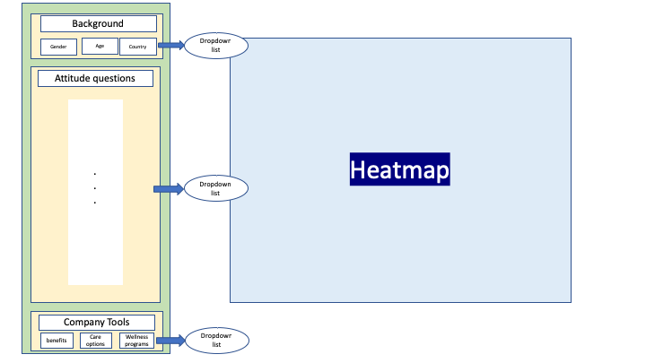

# Proposal - Mental Health Shiny Application

## Overview
The tech sector is built on bright minds developing new solutions to create social and economic impact. Like many industries, the talent is the people. With this in mind, it is important to consider the well being and mental health of all employees to foster a great working environment.  We propose building a data visualization application to illustrate the attitudes around mental health, what companies are doing about it, and how this relates to the well being of the employees. Using this tool An HR manager can get a better understanding of theses attitudes for their company and act accordingly. By filtering the company benefits or the employee backgrounds the user can also learn what company tools are most beneficial and can tailor it to their employees.

## Data
The source of the dataset is available publicly on [kaggle](https://www.kaggle.com/osmi/mental-health-in-tech-survey). This dataset is from a 2014 survey that measures attitudes towards mental health and frequency of mental health disorders in the tech workplace. 
We will be visualizing this survey results for over 1,200 employees all over the world and primarily in the technology industry. This data is predominantly categorical, includes 27 variables but can be grouped into three sections: employee backgrounds, attitudes towards mental health, and company benefits / tools. Each of these sections include several variables which we aim to visualize by use of a 2d bin plot and several filters to visualize the interactions. In addition we will derive overall ranking variables on specific groupings to better summarize the data and provide useful insights.

## Usage Scenario
Heather works for a technology company as an HR manager. She is tasked to monitor and improve the well being and mental health of the employees at her company. To do this she sends out an anonymous survey to her employees gathering information and inputs into the Mental Health Shiny Application. Through interactive visualizations she can quickly discover how the well being of her employees are. In addition to this, she can upload the ongoing OSMI surveys to learn about how the overall sector is performing in mental health and understand which company tools are most beneficial. If she learns that certain benefits have improved attitudes in employees with similar backgrounds as hers, she can take steps towards implementing these benefits.

## Description and Design of the Application
The app contains a landing page that shows a 2 dimensional bin plot of the dataset features coloured coded according to the ranking/probability of each feature. An example could be having the attitudes on the y axis with the company tools on the x axis. From 3 dropdown list (background, attitude questions and company tools), users can select visualizations that provide the most meaningful insights to their use case. A sketch is illustrated below:

